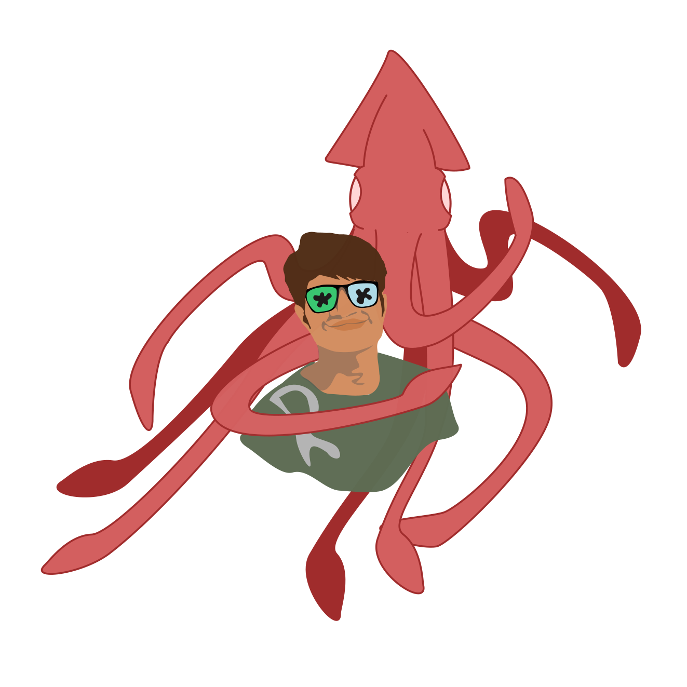

# 🌀 The Unperfect Archive

A living space that grows with me

---

## 🌱 Hello, I'm **"Rahul"**

I didn’t build this site to teach.
I built it to listen.
To myself.
To the world within me.
To the quiet truths that formal existence often overlooks.

This is my archive.
Not to showcase achievements, but to dive into the journey of learning and unlearning.
Not to describe perfection, but to express trust in the process.

Here, I gather fragments: ideas, questions, thoughts, and contradictions.
Some are raw.
Some are tender.
All are good enough.

* **Embracing paradoxes:** Learning to sit with contradictions.
* **Sensing over knowing:** Trusting intuition and instinct.
* **Slowness as wisdom:** Valuing pauses and reflection.
* **Interdependence:** Recognizing that we are never alone in our journeys.

---

## 🔍 What I’m Exploring

### Learning and Unlearning Discourse

Let’s assume that conventional education has played its role for many.
But it has also limited how we can know, feel, and connect with the world and life differently.
So I explore:

* Challenging inherited knowledge
* Decolonizing the mind
* Reimagining success

### Natural Wisdom

From creating to abandoning.
From a safe and secure life to walking completely lost.
I’ve learned to see:

* Patterns in nature
* The wisdom of the body
* Lessons from failure

### S.T.E.A.M. ( Science, Technology, Engineering, Art, & Mathematics ) Recreation

A space to reimagine what I’ve learned formally, informally, and intuitively.
To play with familiar topics in unfamiliar ways.
To evaluate, express, and evolve through my own lens.

* Creative coding experiments
* Art and science collaborations
* Playful problem-solving

### Fragments and Compost

Notes I’m not ready to finish
Seeds I’m planting
Ideas I’m letting rot into something richer

---

## 🧭 Why I Call It "Unperfect"

Because I’m tired of chasing polish.
Because I learn more from the cracks than from the surface.
Because I want to honor the messy, the intuitive, and the unfinished.

To be unperfect is to be alive.

---

## ✨ Why This Archive Matters

* **A space for authenticity:** Embracing imperfection in a world that often values polish.
* **A community of learners & unlearners:** Sharing my journey to support others in theirs.
* **Living documentation:** A constantly evolving record of growth and change.
* **Permission to slow down:** Encouraging others to embrace the beauty of the unfinished.

---

## 🌟 How to Engage

* **Wander curiously:** Explore the archive without a specific destination.
* **Reflect personally:** Use these fragments as prompts for your own thinking.
* **Share your thoughts:** Reach out with your own stories of unlearning.
* **Return often:** The archive is always growing and changing.

---

> “To learn is to remember what we already know.
> To unlearn is to make space for what we’ve forgotten.”

---

## 🌱 Start Exploring

To explore, navigate through the side menu.

---

## 📞 Get in Touch

[rahulosopher@hotmail.com](mailto:rahulosopher@hotmail.com)

---

*Thank you for being here. Let’s Learn & unlearn together.*